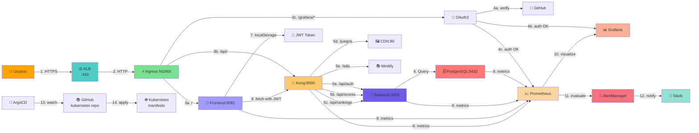
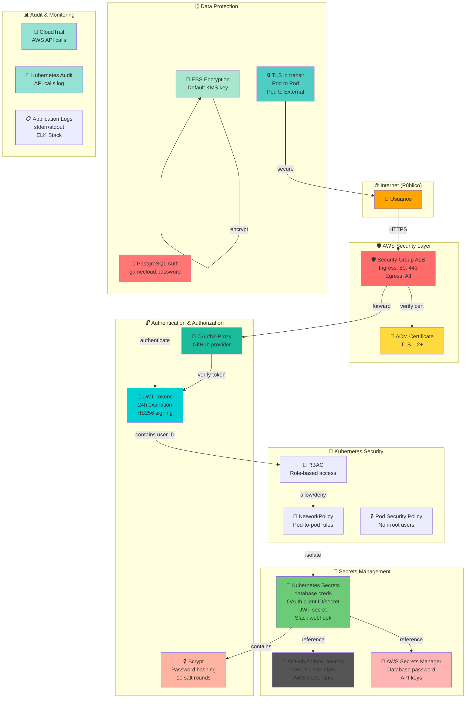
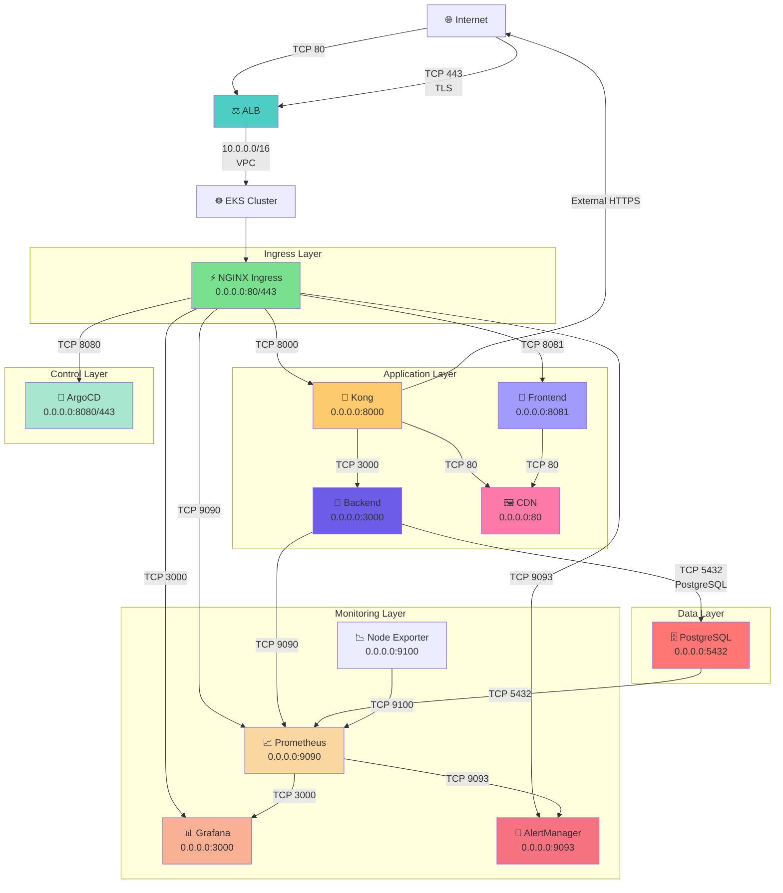
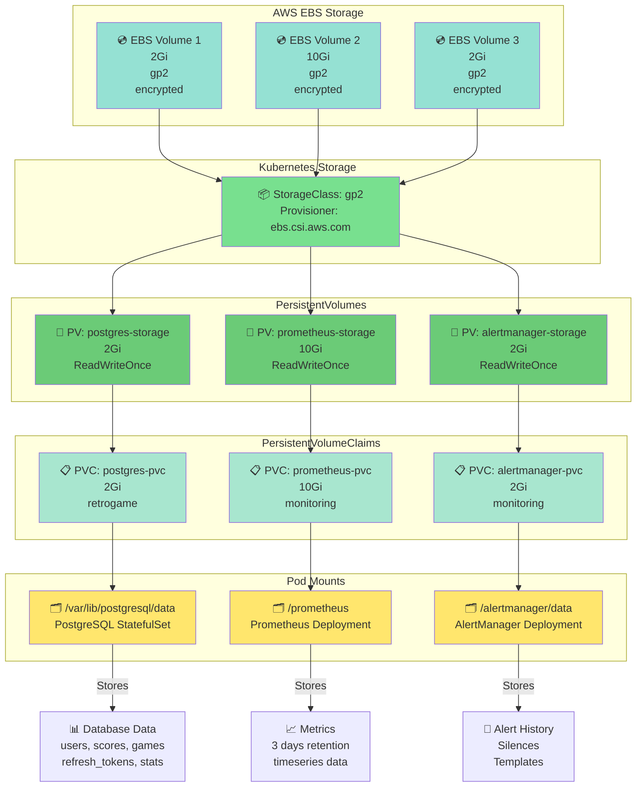
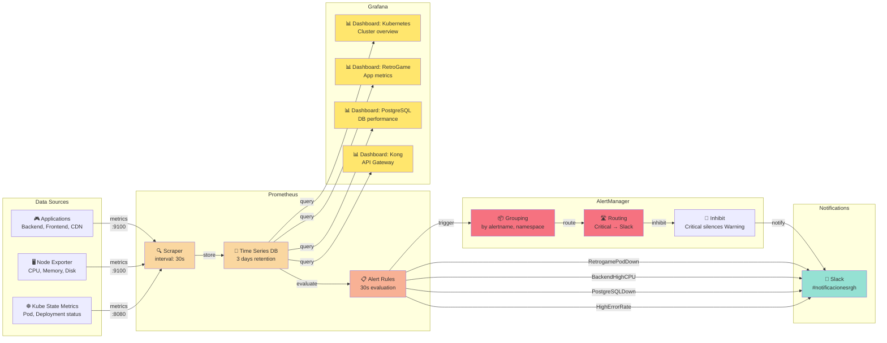
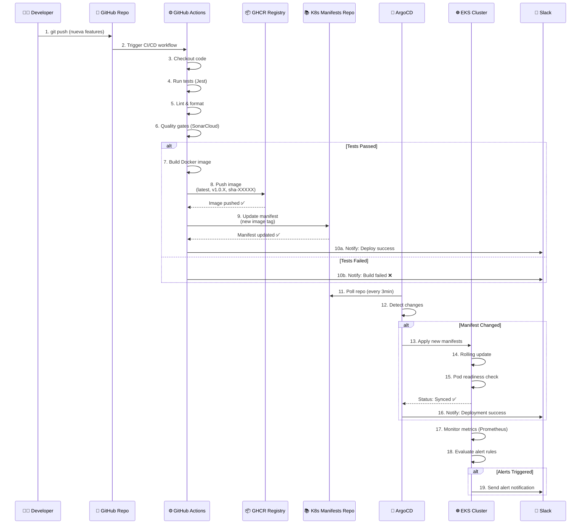

# 🏗️ RetroGameCloud - Diagrama de Infraestructura Detallado

## 1. DIAGRAMA GENERAL (MERMAID)

```mermaid
graph TB
    subgraph "🌐 Internet & DNS"
        USER["👤 Usuario Final"]
        DNS["🔍 Route53<br/>retrogamehub.games"]
    end

    subgraph "🔒 AWS Load Balancing"
        ACM["🔐 ACM Certificate<br/>SSL/TLS"]
        ALB["⚖️ Application Load Balancer<br/>retrogame-alb<br/>puerto 80/443"]
        SGalb["🛡️ Security Group ALB<br/>ingress: 80,443"]
    end

    subgraph "🌍 AWS VPC"
        VPC["📦 VPC: 10.0.0.0/16<br/>eu-west-1"]
        
        subgraph "🌐 Public Subnets"
            PUBSUB1["🔴 Public Subnet 1"]
            PUBSUB2["🔵 Public Subnet 2"]
            PUBSUB3["🟢 Public Subnet 3"]
            IGW["🚪 Internet Gateway"]
            NAT["🔄 NAT Gateway"]
        end

        subgraph "🔐 Private Subnets"
            PRISUB1["🔴 Private Subnet 1"]
            PRISUB2["🔵 Private Subnet 2"]
            PRISUB3["🟢 Private Subnet 3"]
        end

        subgraph "🎮 EKS Cluster"
            EKS["☸️ EKS Cluster v1.28+<br/>retrogamecloud-eks"]
            SGEKS["🛡️ Security Group EKS"]
            
            subgraph "🤖 Node Group: general-nodes"
                NODE1["🖥️ Node 1<br/>t3.small"]
                NODE2["🖥️ Node 2<br/>t3.small"]
                NODE3["🖥️ Node 3<br/>t3.small"]
            end

            subgraph "K8s Namespaces"
                subgraph "🎯 retrogame namespace"
                    BACKEND_DEP["📦 Backend Deployment<br/>2 replicas<br/>3000"]
                    FRONTEND_DEP["🎨 Frontend Deployment<br/>2 replicas<br/>8081"]
                    CDN_DEP["🖼️ CDN Deployment<br/>2 replicas<br/>80"]
                    KONG_DEP["🚪 Kong Deployment<br/>1 replica<br/>8000/8001"]
                    PG_SS["🗄️ PostgreSQL StatefulSet<br/>1 replica<br/>5432"]
                end

                subgraph "📊 monitoring namespace"
                    PROM_DEP["📈 Prometheus<br/>9090"]
                    GRAF_DEP["📊 Grafana<br/>3000"]
                    ALERT_DEP["🔔 AlertManager<br/>9093"]
                    NODEEXP["📉 Node Exporter<br/>DaemonSet"]
                    KSM["📋 Kube State Metrics"]
                end

                subgraph "🔄 argocd namespace"
                    ARGOCD["🔄 ArgoCD<br/>server/repo/controller"]
                end

                subgraph "🌐 ingress-nginx namespace"
                    INGRESS["⚡ Ingress NGINX<br/>Controller"]
                end
            end
        end

        subgraph "💾 Storage"
            EBS1["💿 EBS 2Gi<br/>PostgreSQL"]
            EBS2["💿 EBS 10Gi<br/>Prometheus"]
            EBS3["💿 EBS 2Gi<br/>AlertManager"]
        end

        subgraph "🔐 Security & Secrets"
            GHCR_SEC["🔑 GHCR Secret<br/>docker-registry"]
            PG_SEC["🔑 PostgreSQL Secret<br/>credentials"]
            OAUTH_SEC["🔑 GitHub OAuth Secret<br/>grafana/argocd"]
            SLACK_SEC["🔑 Slack Webhook Secret<br/>alertmanager"]
        end
    end

    subgraph "🔄 CI/CD & GitOps"
        GITHUB["🐙 GitHub<br/>repos"]
        ACTIONS["⚙️ GitHub Actions<br/>CI/CD"]
        GHCR_REG["📦 GHCR Registry<br/>ghcr.io/retrogamecloud"]
    end

    subgraph "🔐 Authentication"
        OAUTH2["🔐 OAuth2-Proxy<br/>GitHub OAuth"]
    end

    subgraph "📡 External Services"
        MINTLIFY["📚 Mintlify Docs<br/>retrogamecloud.mintlify.app"]
        SLACK["💬 Slack<br/>#notificacionesrgh"]
    end

    %% Terraform Infrastructure as Code
    subgraph "📝 Infrastructure as Code"
        TF_BOOTSTRAP["🚀 Terraform Bootstrap<br/>Route53, S3, IAM"]
        TF_EKS["🎯 Terraform EKS<br/>VPC, Cluster, Nodes"]
        TF_ALB["⚖️ Terraform ALB<br/>Listeners, Target Groups"]
        S3_TFSTATE["💾 S3 Bucket<br/>tfstate"]
        DYNAMO["🔒 DynamoDB<br/>state locking"]
    end

    %% Conexiones principales
    USER -->|HTTPS| DNS
    DNS -->|resolve| ALB
    ALB -->|forward| INGRESS
    INGRESS -->|route| BACKEND_DEP
    INGRESS -->|route| FRONTEND_DEP
    INGRESS -->|route| KONG_DEP
    INGRESS -->|auth redirect| OAUTH2
    
    BACKEND_DEP -->|query| PG_SS
    FRONTEND_DEP -->|fetch| CDN_DEP
    FRONTEND_DEP -->|API calls| KONG_DEP
    KONG_DEP -->|route| BACKEND_DEP
    KONG_DEP -->|route| CDN_DEP
    KONG_DEP -->|route| MINTLIFY
    
    PG_SS -->|persist| EBS1
    PROM_DEP -->|persist| EBS2
    ALERT_DEP -->|persist| EBS3
    
    PROM_DEP -->|scrape| BACKEND_DEP
    PROM_DEP -->|scrape| FRONTEND_DEP
    PROM_DEP -->|scrape| KONG_DEP
    PROM_DEP -->|scrape| NODEEXP
    PROM_DEP -->|scrape| KSM
    
    GRAF_DEP -->|read metrics| PROM_DEP
    ALERT_DEP -->|query| PROM_DEP
    ALERT_DEP -->|notify| SLACK
    
    ARGOCD -->|deploy| BACKEND_DEP
    ARGOCD -->|deploy| FRONTEND_DEP
    ARGOCD -->|deploy| KONG_DEP
    ARGOCD -->|sync| GITHUB
    
    GITHUB -->|trigger| ACTIONS
    ACTIONS -->|build & push| GHCR_REG
    ACTIONS -->|update manifest| GITHUB
    GHCR_REG -->|pull image| BACKEND_DEP
    GHCR_REG -->|pull image| FRONTEND_DEP
    GHCR_REG -->|pull image| CDN_DEP
    
    ALB -->|secure with| ACM
    VPC -->|routes| IGW
    VPC -->|routes| NAT
    NODE1 -->|persist via| GHCR_SEC
    NODE2 -->|persist via| GHCR_SEC
    NODE3 -->|persist via| GHCR_SEC
    
    TF_BOOTSTRAP -->|manage| S3_TFSTATE
    TF_BOOTSTRAP -->|lock| DYNAMO
    TF_EKS -->|create| EKS
    TF_ALB -->|create| ALB
    
    style USER fill:#FFA500
    style DNS fill:#FF6B6B
    style ALB fill:#4ECDC4
    style VPC fill:#95E1D3
    style EKS fill:#38ada9
    style INGRESS fill:#78e08f
    style BACKEND_DEP fill:#6c5ce7
    style FRONTEND_DEP fill:#a29bfe
    style CDN_DEP fill:#fd79a8
    style KONG_DEP fill:#fdcb6e
    style PG_SS fill:#FF7675
    style PROM_DEP fill:#FAD7A0
    style GRAF_DEP fill:#F8B195
    style ALERT_DEP fill:#F67280
    style ARGOCD fill:#A8E6CF
    style GITHUB fill:#555555
    style GHCR_REG fill:#333333
```

---

## 2. DIAGRAMA DE FLUJO DE DATOS

---

## 3. DIAGRAMA DE KUBERNETES (NAMESPACES Y PODS)

```mermaid
graph TB
    subgraph "retrogame namespace"
        direction LR
        BACKEND_POD["🔌 backend-deployment<br/>pod-abc123<br/>3000/TCP"]
        BACKEND_POD2["🔌 backend-deployment<br/>pod-def456<br/>3000/TCP"]
        FRONTEND_POD["🎨 frontend-deployment<br/>pod-xyz789<br/>8081/TCP"]
        FRONTEND_POD2["🎨 frontend-deployment<br/>pod-uvw012<br/>8081/TCP"]
        CDN_POD["🖼️ cdn-deployment<br/>pod-qrs345<br/>80/TCP"]
        CDN_POD2["🖼️ cdn-deployment<br/>pod-tuv678<br/>80/TCP"]
        KONG_POD["🚪 kong-deployment<br/>pod-mno901<br/>8000/8001"]
        PG_POD["🗄️ postgres-db-0<br/>StatefulSet<br/>5432/TCP"]
        
        BACKEND_SVC["☸️ Service<br/>gamehub-database-service:3000"]
        FRONTEND_SVC["☸️ Service<br/>frontend-service:8081"]
        CDN_SVC["☸️ Service<br/>cdn-service:80"]
        KONG_SVC["☸️ Service<br/>kong-service:8000"]
        PG_SVC["☸️ Service<br/>postgres-db:5432"]
        
        BACKEND_POD --> BACKEND_SVC
        BACKEND_POD2 --> BACKEND_SVC
        FRONTEND_POD --> FRONTEND_SVC
        FRONTEND_POD2 --> FRONTEND_SVC
        CDN_POD --> CDN_SVC
        CDN_POD2 --> CDN_SVC
        KONG_POD --> KONG_SVC
        PG_POD --> PG_SVC
    end

    subgraph "monitoring namespace"
        direction LR
        PROM_POD["📈 prometheus-0<br/>StatefulSet<br/>9090/TCP"]
        GRAF_POD["📊 grafana<br/>Deployment<br/>3000/TCP"]
        ALERT_POD["🔔 alertmanager-0<br/>StatefulSet<br/>9093/TCP"]
        NODEEXP_POD1["📉 node-exporter<br/>DaemonSet<br/>9100/TCP"]
        NODEEXP_POD2["📉 node-exporter<br/>DaemonSet<br/>9100/TCP"]
        NODEEXP_POD3["📉 node-exporter<br/>DaemonSet<br/>9100/TCP"]
        KSM_POD["📋 kube-state-metrics<br/>Deployment<br/>8080/TCP"]
        
        PROM_SVC["☸️ Service<br/>prometheus:9090"]
        GRAF_SVC["☸️ Service<br/>grafana:3000"]
        ALERT_SVC["☸️ Service<br/>alertmanager:9093"]
        
        PROM_POD --> PROM_SVC
        GRAF_POD --> GRAF_SVC
        ALERT_POD --> ALERT_SVC
        NODEEXP_POD1 -.->|scrape by| PROM_POD
        NODEEXP_POD2 -.->|scrape by| PROM_POD
        NODEEXP_POD3 -.->|scrape by| PROM_POD
        KSM_POD -.->|scrape by| PROM_POD
    end

    subgraph "argocd namespace"
        direction LR
        ARGOCD_SERVER["🔄 argocd-server<br/>pod<br/>8080/443"]
        ARGOCD_REPO["🔄 argocd-repo-server<br/>pod"]
        ARGOCD_CTRL["🔄 argocd-controller<br/>pod"]
        ARGOCD_SVC["☸️ Service<br/>argocd-server:443"]
        
        ARGOCD_SERVER --> ARGOCD_SVC
        ARGOCD_REPO -.->|communicate| ARGOCD_SERVER
        ARGOCD_CTRL -.->|watch| GITHUB_SYNC["🐙 GitHub Sync"]
    end

    subgraph "ingress-nginx namespace"
        direction LR
        INGRESS_POD["⚡ ingress-nginx<br/>Deployment<br/>80/443"]
        INGRESS_SVC["☸️ Service<br/>LoadBalancer<br/>80/443"]
        
        INGRESS_POD --> INGRESS_SVC
    end

    subgraph "kube-system namespace"
        COREDNS["🔍 coredns"]
        VPC_CNI["🌐 aws-vpc-cni"]
        KUBEP["⚙️ kube-proxy"]
    end

    %% Ingress rules
    INGRESS_SVC -->|path /| FRONTEND_SVC
    INGRESS_SVC -->|path /api/*| KONG_SVC
    INGRESS_SVC -->|path /grafana| GRAF_SVC
    INGRESS_SVC -->|path /prometheus| PROM_SVC
    INGRESS_SVC -->|path /alertmanager| ALERT_SVC

    %% Pod to Service communication
    KONG_POD -->|connect to| BACKEND_SVC
    KONG_POD -->|connect to| CDN_SVC
    FRONTEND_POD -->|connect to| CDN_SVC
    BACKEND_SVC -->|query| PG_SVC
    
    %% Metrics scraping
    PROM_POD -->|scrape| BACKEND_SVC
    PROM_POD -->|scrape| FRONTEND_SVC
    PROM_POD -->|scrape| KONG_SVC
    PROM_POD -->|scrape| COREDNS
    
    GRAF_POD -->|query| PROM_SVC
    ALERT_POD -->|query| PROM_SVC

    style BACKEND_SVC fill:#6c5ce7
    style FRONTEND_SVC fill:#a29bfe
    style KONG_SVC fill:#fdcb6e
    style PG_SVC fill:#FF7675
    style PROM_SVC fill:#FAD7A0
    style GRAF_SVC fill:#F8B195
    style ALERT_SVC fill:#F67280
    style INGRESS_SVC fill:#78e08f
```

---

## 4. DIAGRAMA DE CAPAS DE LA ARQUITECTURA

```mermaid
graph TB
    subgraph "CAPA 1: USUARIOS"
        L1["👤 End Users<br/>Navegadores Web"]
    end

    subgraph "CAPA 2: DNS & CDN GLOBAL"
        L2["🌐 Route53 (DNS)<br/>🔐 ACM (Certificados)"]
    end

    subgraph "CAPA 3: LOAD BALANCING"
        L3["⚖️ Application Load Balancer<br/>Puerto 80 → redirect 443<br/>Puerto 443 → HTTPS<br/>Path-based routing"]
    end

    subgraph "CAPA 4: API GATEWAY & ROUTING"
        L4a["🔐 OAuth2-Proxy<br/>(GitHub Auth)"]
        L4b["⚡ Ingress NGINX<br/>Internal routing"]
        L4c["🚪 Kong API Gateway<br/>Rate limiting: 500/min<br/>CORS handling"]
    end

    subgraph "CAPA 5: APLICACIONES"
        L5a["🎨 Frontend<br/>Node.js/Express<br/>HTML/CSS/JS<br/>2 replicas"]
        L5b["🔌 Backend API<br/>Node.js/Express<br/>Auth, Scores, Rankings<br/>2 replicas"]
        L5c["🖼️ CDN<br/>Nginx static files<br/>2 replicas"]
    end

    subgraph "CAPA 6: DATA STORAGE"
        L6["🗄️ PostgreSQL<br/>StatefulSet<br/>Persistent Volume: 2Gi<br/>Tables: users, scores, games"]
    end

    subgraph "CAPA 7: OBSERVABILITY"
        L7a["📈 Prometheus<br/>Metrics collection<br/>10Gi retention 3d"]
        L7b["📊 Grafana<br/>Dashboards<br/>GitHub OAuth"]
        L7c["🔔 AlertManager<br/>Alert routing<br/>Slack integration"]
    end

    subgraph "CAPA 8: GITOPS & DEPLOYMENT"
        L8a["🐙 GitHub<br/>Source control<br/>Workflows"]
        L8b["⚙️ GitHub Actions<br/>Build, Test, Push"]
        L8c["📦 GHCR<br/>Container Registry"]
        L8d["🔄 ArgoCD<br/>Continuous Deployment<br/>Auto-sync"]
    end

    subgraph "CAPA 9: INFRASTRUCTURE AS CODE"
        L9["🚀 Terraform<br/>Bootstrap (Route53, S3, IAM)<br/>EKS (Cluster, VPC)<br/>ALB (Target Groups)<br/>Monitoring Stack"]
    end

    subgraph "CAPA 10: CLOUD PROVIDER"
        L10["☁️ AWS<br/>EKS Cluster<br/>VPC Networking<br/>Security Groups<br/>EBS Storage"]
    end

    L1 -->|HTTPS| L2
    L2 -->|Resolve DNS| L3
    L3 -->|Forward request| L4b
    L4b -->|OAuth check| L4a
    L4b -->|Route| L4c
    L4c -->|API calls| L5b
    L4c -->|Static files| L5c
    L4c -->|UI| L5a
    L5a -->|Connect to| L5b
    L5b -->|Query data| L6
    L5b -->|Emit metrics| L7a
    L5c -->|Emit metrics| L7a
    L7a -->|Store metrics| L7a
    L7a -->|Visualize| L7b
    L7a -->|Alert rules| L7c
    L8a -->|Push code| L8b
    L8b -->|Build & test| L8c
    L8c -->|Pull images| L5b
    L8d -->|Watch repo| L8a
    L8d -->|Deploy manifests| L4b
    L9 -->|Provision| L10
    L10 -->|Run| L4b
    
    style L1 fill:#FFA500
    style L2 fill:#FF6B6B
    style L3 fill:#4ECDC4
    style L4a fill:#1abc9c
    style L4b fill:#78e08f
    style L4c fill:#fdcb6e
    style L5a fill:#a29bfe
    style L5b fill:#6c5ce7
    style L5c fill:#fd79a8
    style L6 fill:#FF7675
    style L7a fill:#FAD7A0
    style L7b fill:#F8B195
    style L7c fill:#F67280
    style L8a fill:#555555
    style L8b fill:#777777
    style L8c fill:#333333
    style L8d fill:#A8E6CF
    style L9 fill:#FFE66D
    style L10 fill:#95E1D3
```

---

## 5. DIAGRAMA DE SEGURIDAD Y ACCESO

---

## 6. DIAGRAMA DE CI/CD PIPELINE

```mermaid
graph LR
    subgraph "📝 Development"
        DEV["👨‍💻 Developer<br/>git push"]
        REPO["🐙 GitHub Repo<br/>main branch"]
    end

    subgraph "🔄 GitHub Actions"
        TRIGGER["⚙️ Workflow Trigger<br/>on: push to main"]
        CHECKOUT["📥 Checkout Code"]
        LINT["📋 Lint & Format<br/>ESLint, Prettier"]
        TEST["🧪 Run Tests<br/>Jest, Supertest<br/>Coverage ≥ 70%"]
        QUALITY["✅ Quality Gate<br/>SonarCloud<br/>Codecov"]
    end

    subgraph "🐳 Build & Registry"
        BUILD["🔨 Build Docker Image"]
        TAG["🏷️ Tag Image<br/>latest<br/>v1.0.X<br/>sha-XXXXX"]
        PUSH["📤 Push to GHCR<br/>ghcr.io/retrogamecloud/..."]
    end

    subgraph "📚 Update Manifests"
        UPDATE["✏️ Update K8s Manifests<br/>Change image tag"]
        COMMIT["💾 Commit to<br/>retrogamecloud/kubernetes"]
        PUSH_REPO["📤 Push to GitHub"]
    end

    subgraph "🔄 GitOps (ArgoCD)"
        WATCH["👁️ Watch Repo<br/>polling every 3min"]
        DETECT["🔍 Detect Change<br/>manifest differs"]
        SYNC["🔄 Sync Cluster<br/>apply manifests"]
        DIFF["📊 Show Diff"]
    end

    subgraph "☸️ Kubernetes Deployment"
        PULL["📥 Pull Image<br/>from GHCR"]
        DEPLOY["🚀 Deploy Pods<br/>Rolling update"]
        VERIFY["✅ Verify Status<br/>readiness probe"]
    end

    subgraph "📊 Post-Deployment"
        MONITOR["📈 Monitor Metrics<br/>Prometheus scrape"]
        ALERT["🔔 Alert if issue<br/>AlertManager"]
        ROLLBACK["⏮️ Auto-rollback<br/>if failed"]
    end

    DEV -->|push code| REPO
    REPO -->|trigger| TRIGGER
    TRIGGER -->|run| CHECKOUT
    CHECKOUT -->|lint| LINT
    LINT -->|test| TEST
    TEST -->|quality gate| QUALITY
    QUALITY -->|build| BUILD
    BUILD -->|tag| TAG
    TAG -->|push| PUSH
    PUSH -->|update manifest| UPDATE
    UPDATE -->|commit| COMMIT
    COMMIT -->|push| PUSH_REPO
    PUSH_REPO -->|watch| WATCH
    WATCH -->|detect| DETECT
    DETECT -->|show| DIFF
    DIFF -->|apply| SYNC
    SYNC -->|pull| PULL
    PULL -->|deploy| DEPLOY
    DEPLOY -->|verify| VERIFY
    VERIFY -->|monitor| MONITOR
    MONITOR -->|alert| ALERT
    ALERT -->|rollback if needed| ROLLBACK

    style REPO fill:#555555
    style TRIGGER fill:#777777
    style BUILD fill:#333333
    style TAG fill:#111111
    style PUSH fill:#444444
    style WATCH fill:#A8E6CF
    style SYNC fill:#78e08f
    style DEPLOY fill:#6BCB77
    style MONITOR fill:#FAD7A0
    style ALERT fill:#F67280
```

---

## 7. DIAGRAMA DE NETWORKING (PUERTOS Y PROTOCOLOS)

---

## 8. DIAGRAMA DE VOLÚMENES Y PERSISTENCIA

---

## 9. DIAGRAMA DE MONITORING Y ALERTAS

---

## 10. DIAGRAMA DE DESPLIEGUE (DEPLOYMENT PIPELINE)

---

## 📋 RESUMEN DE COMPONENTES POR CAPAS

| Capa | Componentes | Cantidad |
|------|------------|----------|
| **Internet** | Usuarios, Navegadores | - |
| **DNS** | Route53, ACM Certificate | 2 |
| **Load Balancing** | ALB, Target Groups | 6 |
| **Ingress** | NGINX Ingress Controller | 1 |
| **API Gateway** | Kong | 1 |
| **Applications** | Backend, Frontend, CDN | 3 |
| **Database** | PostgreSQL | 1 |
| **Monitoring** | Prometheus, Grafana, AlertManager | 3 |
| **Observability** | Node Exporter, Kube State Metrics | 2 |
| **GitOps** | ArgoCD, GitHub, GitHub Actions | 3 |
| **Security** | OAuth2-Proxy, Secrets | Multiple |
| **Infrastructure** | EKS, VPC, Subnets, Security Groups | Multiple |

---

Este documento contiene **10 diagramas completos** que cubren todos los aspectos de la infraestructura de RetroGameCloud. 🎮
